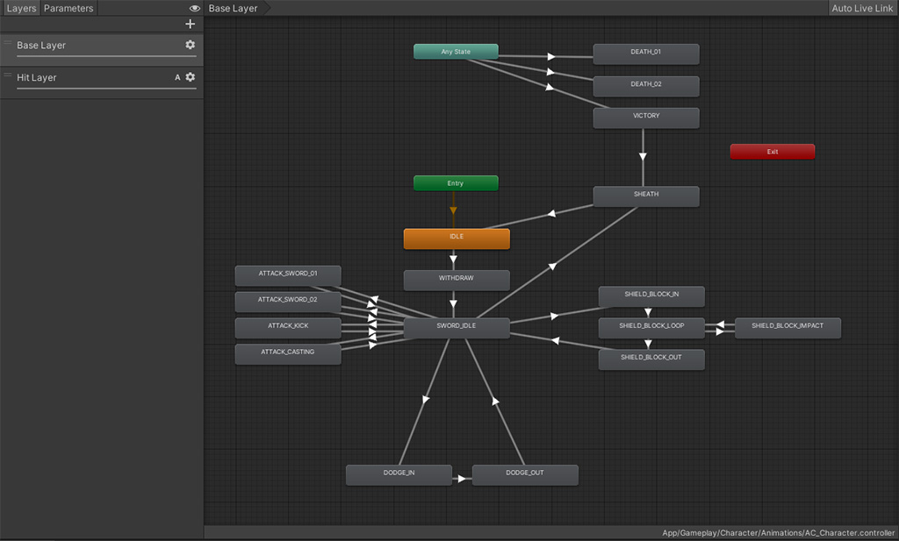
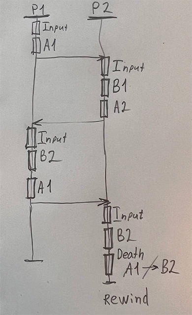

# Description
### Requirements
- Unity 2021.3.12 ([Release notes & download](https://unity3d.com/unity/whats-new/2021.3.12))
- Visual Studio 2021 ([Link](https://visualstudio.microsoft.com/vs/)) or JB Rider ([Link](https://www.jetbrains.com/lp/dotnet-unity/))

> This branch contains an unfinished raw prototype of what is described in below sections.

## Prototype
As per a little research to figure out what will work best for the game (due to vague description), the first take was to implement a realtime battle, where the player needs to react to attack following markers on a timeline which indicates when the recorded actions occur.

Since Unity's _Legacy Input_ is gettinng deprecated, we will proceed with the new `InputSystem` which is taking over the old one.

Does Unity provide any existing tools that might help out with input recording? Kind of yes, so based on that, there could've been two approaches:

- Using Unity's InputSystem `InputEventTrace`, controlling 2nd character by sending recorded input events into a virtual input device bound to the character controller.
- Using custom solution to record `InputAction`s with their timestamps into a collection, using FixedUpdate to invoke input action callbacks according to their timestamps.

After spending some time with `Unity​Engine.​Input​System.​Low​Level.InputEventTrace` and `Unity​Engine.​Input​System.​Utilities.InputActionTrace`, it turned too much time consuming as those tools seem to be designed for debugging/analytics, but still could be adapted for our needs, I believe. Thus, dealing with byte input data is not what this demo should be.

Taken the second option, an input recorder with a `LinkedList<InputRecord>` has been implemented.
It's simple to add new records at the end of the list and replaying the sequence with right timing by comparing next record timestamp in _FixedUpdate_ (for more precision).

The following rough design then comes to mind:
- `InputRecorder` tracks and replays input actions by timestamps for each character
- `PlayerCharacterAnimator` holds API for triggering animations with _OnAnimationFinished_ callbacks
- `CharacterStateData` a plain C# class model for easily managing character's runtime parameters
- `BattleController` holds together 2 characters on scene and their state, runs/stops recording and replaying
- `IPlayerControllable` a contract for a possessable character
- `IDamageTarget` a contract for a character to lock on and put damage hits into
- Two types of attack and two tipes of defend actions of two tiers

> As from game design perspective, several attack/defend tiers would require some kind of "points" to spend on, otherwise it makes no sence cause high-tier actions became abused. So for demo purpose it's better to later on use pair of attack (A) defence (B) actions, for ex. B2 blocks A2 but not A1 and so on.

The battle then started to depend on player's reaction speed, which adds cognetive complexity to the gameplay as the core gameplay was stated as "memorizing input sequence", not reaction.

Realtime battle also increases overall complexity:
- Player reaction relies on animations, so animations should be adjusted
- Characters should react according to animations timing, so animations swould be awaited / fire animation events
- To process different character states, state machines are likely to be used

And animator controller starts getting a bit sophisticated than it should be.

And the confusion comes from the doc's description:
> the actions from the not controlled character need to be replayed at the same paste/speed the player performed them

That's, by nature, looks like definition of realtime battle. We replay input according to timestamps, reacting with follow up input of another character, trying to hit the time marker pressing the valid action as well as deflecting attacks in the proper time.

## Analytics
Then, questions like "whether should it be realtime/turn-based, are any POC examples or similar games exist" have been answered, and summary composed:

- It's turn based
- Animations being played in "realtime"
- The point is, repeat the accruing sequence of input actions
- Assuming that "rewind" is just a reset of states without visual playback

Realtime animations and turn based can't be put together, in my comprehension. The animation is rather playing or not, it's always "realtime".
So, combining those theses, the game could look like:

- Turn based means game events are sequential, coming one after another (switching sides does not make the game "turn based"). Means, characters wait each other actions.
- "Realtime animations" mean they played as a part of a turn, so before proceed to the next step, animation should finish playing.

The sequence diagram of a battle after 4 rewinds would look like:

Which looks kind of it makes no sence to me, frankly.

After some tough thinking process, one more approach appeared:
1. Set input actions sequence for a character
2. Hit play
3. See the character follows the input
4. At the same time, the second character follows it's previous input actions sequence

This way it resolves most of shenanigans, but diverges from the docs description regarding timeline. Including timeline we still introduce the realtime reaction complexity, which is not turn based.

# Summary
In conclusion, there are 4 possible implementations:

1. Realtime battle, involves memorizing and reaction (complex)
2. Turn based battle with synchronious steps, involves less memorizing (easy)
3. Turn based battle with pre-set input sequence (several actions before playing), involves more memorizing (simple)
4. Realtime battle with pre-set input sequence hitting the timeline, then plays the input - involves memorizing and reaction (complex)